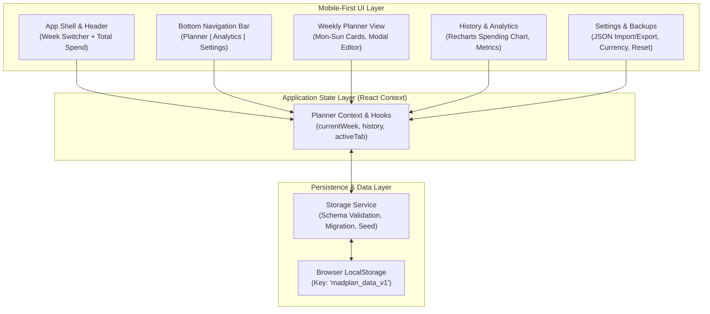

# Development Plan: Weekly Dinner Planner (`madplan`)

**Status:** Completed  
**Based on:** `project_handoff_plan.md`  
**Target Platform:** Static Web Application (GitHub Pages)  
**Target Experience:** Mobile-First Responsive PWA  

---

## 1. Executive Summary & Goals

The **Weekly Dinner Planner** (`madplan`) is a mobile-first, client-side web application created to simplify a family's weekly dinner planning and grocery spending management. 

### Key Deliverables
- **Weekly Dinner Schedule (Mon–Sun):** Interactive daily meal cards detailing dinner courses, ingredient checklists, and costs.
- **Real-Time Cost Aggregation:** Dynamic weekly expense calculation with customizable currency symbols.
- **Spending History & Visual Analytics:** Historical trends visualization (weekly spending over time, average weekly budget, high/low weeks) using responsive charts.
- **Zero-Backend Persistence:** Robust `localStorage` engine with data validation, versioned schema, and JSON import/export for family backups.
- **GitHub Pages CI/CD:** Fully automated GitHub Actions deployment with zero hosting cost.

---

## 2. Technical Stack & Architecture

| Layer | Selected Technology | Rationale |
|---|---|---|
| **Bundler & Build** | **Vite + TypeScript** | Sub-second HMR, strict type safety for data models, lightweight production bundles. |
| **Framework** | **React 18+** | Component modularity, rich ecosystem, reliable declarative state management. |
| **Styling** | **Tailwind CSS + PostCSS** | Rapid mobile-first styling, minimal bundle footprint via purge, built-in responsive utilities. |
| **Icons** | **Lucide React** | Clean, lightweight SVG icon set optimized for modern mobile navigation and UI affordances. |
| **Charting** | **Recharts** (or **Chart.js** via `react-chartjs-2`) | Declarative, SVG-based responsive charting that renders cleanly across varied mobile screen resolutions. |
| **Storage & State** | **Custom React Context + LocalStorage Adapter** | Zero external server dependencies; immediate offline availability with seed data bootstrap. |
| **Hosting & CI/CD** | **GitHub Pages + GitHub Actions** | Static asset hosting configured via `vite.config.ts` base path and automated deployment workflows. |

### Application Architecture Diagram



---

## 3. Data Architecture & Schema

To satisfy both the handoff plan requirements and extend support for ingredients and currency customization, the storage model is structured as follows:

### TypeScript Interfaces

```typescript
export type DayOfWeek = 
  | 'Monday' 
  | 'Tuesday' 
  | 'Wednesday' 
  | 'Thursday' 
  | 'Friday' 
  | 'Saturday' 
  | 'Sunday';

export interface IngredientItem {
  id: string;
  name: string;
  isPurchased?: boolean;
}

export interface MealEntry {
  id: string;
  day: DayOfWeek;
  course: string;            // Name of the meal (e.g., "Spaghetti Bolognese")
  cost: number;              // Cost in user currency
  ingredients: IngredientItem[]; // List of required ingredients
  notes?: string;            // Optional preparation note or chef
}

export interface WeekPlan {
  id: string;                // e.g. "2026-W40"
  weekNumber: number;        // ISO 8601 week number (1-53)
  year: number;              // e.g. 2026
  meals: MealEntry[];        // 7 days Monday-Sunday
  totalSpent: number;        // Computed aggregate sum of meal costs
  budgetGoal?: number;       // Optional weekly budget target
  updatedAt: string;         // ISO timestamp
}

export interface AppSettings {
  currencySymbol: string;    // e.g., "kr.", "$", "€", "£"
  currencyPosition: 'prefix' | 'suffix';
  theme: 'light' | 'dark' | 'system';
}

export interface AppDatabase {
  version: number;           // Schema version (e.g., 1)
  currentWeekId: string;     // Active week selected
  weeks: Record<string, WeekPlan>; // Keyed by weekId for O(1) lookups
  settings: AppSettings;
}
```

### Storage Resilience & Bootstrap
1. **First-Run Seeding:** If `localStorage` is empty, auto-populate the database with the current week and 4–8 previous weeks of realistic mock data so analytics charts look rich immediately.
2. **Atomic Writes & Safe Parsing:** Guard JSON reads/writes with error-handling fallbacks to prevent corrupted states.
3. **Data Portability:** Dedicated Export to JSON and Import from JSON functions to allow cross-device sync between family members without a backend.

---

## 4. UI/UX Design System (Mobile-First)

The UI will emulate a modern iOS/Android native app experience:
- **Mobile Container:** Centered max-width shell (`max-w-md` or `max-w-lg`) on desktop screens with subtle shadow and border, rendering as a full-bleed app on mobile devices.
- **Top Header:**
  - Displays current week identifier (e.g., "Week 40, 2026") with quick Prev/Next week stepper arrows.
  - Floating badge showing the **Total Weekly Spent** with color status (e.g., green if within budget).
- **Day Meal Card:**
  - Distinct day badge with date indicator.
  - Meal name prominently displayed with visual category icon.
  - Ingredient chip summary (e.g., "3 ingredients").
  - Price pill tag (e.g., "$15.00" or "115 kr.").
  - Tap card to open the **Meal Edit Sheet/Modal**.
- **Bottom Navigation Bar:**
  - Fixed-bottom iOS style navigation tab:
    - 🗓️ **Planner** (Weekly view)
    - 📊 **Analytics** (Spending graphs & history)
    - ⚙️ **Settings** (Backup, Currency, Clear Data)
- **Touch-Optimized Controls:** Minimum touch target sizes of 44x44px, bottom sheet drawers for mobile forms, smooth transitions, and tactile button feedback.

---

## 5. Detailed Implementation Phases

### Phase 1: Project Initialization & Modern Mobile Shell
- [x] Initialize project using Vite with React + TypeScript template.
- [x] Configure Tailwind CSS with modern color palette and mobile-optimized typography.
- [x] Install dependencies: `lucide-react`, `recharts` (or `chart.js` + `react-chartjs-2`), `clsx`, `tailwind-merge`.
- [x] Configure `vite.config.ts` with correct `base` path for GitHub Pages deployment.
- [x] Implement mobile-responsive App Shell:
  - Top navigation bar with week switcher.
  - Main scrollable content view.
  - Sticky bottom tab bar (Planner, Analytics, Settings).

### Phase 2: Data Architecture & Persistence Layer
- [x] Define full TypeScript models and interfaces in `src/types/planner.ts`.
- [x] Implement date utility functions in `src/utils/dateUtils.ts` (ISO week calculation, current week resolution, start/end dates for any week).
- [x] Build `src/services/storageService.ts`:
  - `loadDatabase()` and `saveDatabase()`.
  - Schema initialization with realistic mock data (current week + 6 prior weeks).
  - Reset to sample data and export/import helpers.
- [x] Create `PlannerContext` and custom hook `usePlanner()` providing reactive state across the app.

### Phase 3: Weekly Planner & Daily Meal Management
- [x] Create `WeekView` component:
  - Grid/list of 7 daily cards (Monday through Sunday).
  - Empty-state prompt when no meal is scheduled for a given day ("+ Plan dinner").
  - Cost badge dynamically updating when meals are edited.
- [x] Implement `MealEditModal` (or slide-over bottom sheet for mobile):
  - Meal name input with autocomplete suggestions / recent favorites.
  - Cost input with numeric keypad format and currency formatting.
  - Dynamic ingredient list (add, edit, check off, remove items).
  - Quick action to duplicate meal or clear day.
- [x] Implement `WeekSummaryHeader`:
  - Live calculated total amount spent.
  - Progress indicator if a budget goal is set.
  - "Copy to next week" or "Clear week" utility options.

### Phase 4: History & Visual Analytics
- [x] Create `AnalyticsView` component:
  - Metric summary cards:
    - **Average Weekly Spend**
    - **Highest Spending Week**
    - **Lowest Spending Week**
    - **All-Time Planned Meals Count**
  - **Spending Trend Chart:**
    - Interactive bar or line chart showing `totalSpent` across chronological weeks.
    - Custom tooltip showing week number, total cost, and meal highlights.
    - Budget reference line (if budget goal is defined).
  - **Past Weeks Breakdown List:**
    - Collapsible accordion of previous weeks with quick summary of meals and costs.
    - Ability to click into any past week to view details or copy meals.

### Phase 5: Settings, Data Backup & Accessibility Polish
- [x] Build `SettingsView`:
  - Currency symbol configuration (e.g., $, €, kr., £).
  - Weekly budget target setting.
  - Data management: "Export Plan (JSON)", "Import Plan (JSON)", and "Reset to Demo Data".
- [x] Mobile & Accessibility Audits:
  - Ensure contrast ratios meet WCAG AA standards.
  - Semantic HTML (`<main>`, `<nav>`, `<header>`, `<article>`, `<dialog>`).
  - Safe-area insets padding (`env(safe-area-inset-bottom)`) for modern mobile notches and home indicators.
  - Smooth modal focus trapping and escape-key handling.

### Phase 6: Automated CI/CD & GitHub Pages Deployment
- [x] Create GitHub Actions workflow (`.github/workflows/deploy.yml`):
  - Triggers on push to `main` branch.
  - Checks out code, sets up Node.js, installs dependencies (`npm ci`), runs build (`npm run build`).
  - Deploys static build artifacts to `gh-pages` branch via `actions/deploy-pages`.
- [x] Verify production build locally (`npm run build && npm run preview`).
- [x] Validate relative asset paths and 404-free navigation.

---

## 6. Risk Analysis & Mitigation Strategies

| Risk | Impact | Likelihood | Mitigation Strategy |
|---|---|---|---|
| **LocalStorage Quota Limit** | High | Low | Storing text JSON for hundreds of weeks requires < 500 KB (browser limit is ~5MB). Include export/cleanup tools. |
| **Data Loss on Browser Cache Clear** | High | Medium | Add clear UI prompts in Settings recommending periodic JSON export / family backup. |
| **GitHub Pages 404 on Deep Linking** | Medium | Low | Use in-app tab state navigation or HashRouter (`/#/history`) instead of standard HTML5 pushState to guarantee GitHub Pages static compatibility. |
| **Mobile Chart Sizing / Overflow** | Medium | Medium | Use responsive container wrappers with fixed aspect ratios and horizontal swipe capability for extended histories. |
| **ISO Week & Date Complexity across Year Boundaries** | Medium | Low | Use standardized ISO-8601 week calculations (`date-fns` or robust lightweight pure TS utility) to prevent week numbering bugs. |

---

## 7. Definition of Done (DoD) & Acceptance Criteria

- [x] **Spec Alignment:** Covers all features specified in `project_handoff_plan.md`.
- [x] **Mobile-First UX:** Fluid layout tested on mobile viewports (375px - 430px) as well as desktop displays.
- [x] **Meal CRUD & Cost Rollup:** Users can schedule meals with ingredients and costs for all 7 days; weekly total updates synchronously.
- [x] **Interactive Visual Analytics:** History chart cleanly depicts weekly spending trends with responsive tooltips and metric cards.
- [x] **Offline Resilience:** All modifications persist in `localStorage`; demo data loads seamlessly on cold start.
- [x] **Static Deployment Ready:** `npm run build` succeeds cleanly with zero linting/TS errors and deploys to GitHub Pages via automated workflow.
